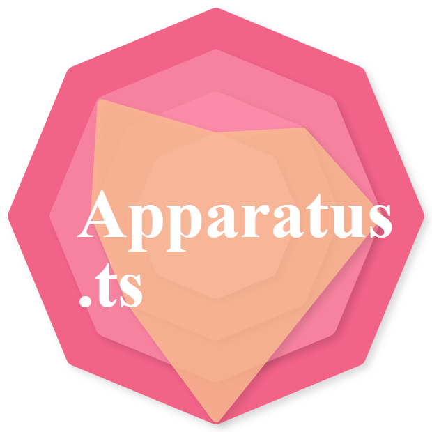

# Apparatus.ts

> Apparatus.ts is a very basic 2D Render Engine for browser JavaScript run-times using Canvas API, written in TypeScript. 

Gist of this package is basically it is an object-oriented solution to 2D canvas rendering, so almost everything has its own class and, thanks to TypeScript, even types and interfaces.

You create your scene, add your objects and even create you custom compound shapes what we like to call components. Manipulating these objects, such as scaling positioning and rotating and coloring even with gradients is meant to be dead simple, and effective. From loading images to drawing complex shapes, the aim of this project to keep everything simple to the developer. So go ahead and check this package out in GitHub and npm if you are interested or just simply get started.

See; 
- [GitHub Repo](https://github.com/TMWWDW/Apparatus.ts)
- [npm package](https://www.npmjs.com/package/apparatus.ts)
- [Documentation](#) (Not yet present)